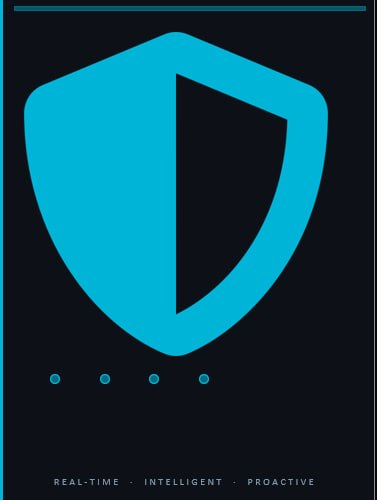

# 🛡️ SMART GUARDIAN: AI-Powered Surveillance System

 <!-- Placeholder for potential banner -->

**Smart Guardian** is a professional-grade security surveillance system that leverages cutting-edge AI to provide real-time threat detection, motion monitoring, and automated alerting. Designed for both high-performance desktop use and versatile web management, it offers a comprehensive solution for modern security needs.

---

## ✨ Key Features

- **🚀 Real-Time AI Detection**: Powered by YOLOv5s, the system identifies specific threats including persons and various weapon types (pistols, rifles, swords,knives) with high accuracy.
- **📹 Multi-Camera Grid**: View and manage multiple camera feeds simultaneously through a responsive, low-latency dashboard.
- **🔔 Intelligent Alerting**: Instant notifications via **Telegram**,**local storage**, **Sms** and **WhatsApp** when a threat or motion is detected.
- **📊 Interactive Dashboard**: Visualize security statistics, event history, and detection trends over time.
- **💾 Event History & Storage**: Automatically logs all detection events to a local SQLite database and supports backup to **Google Drive**.
- **🖥️ Desktop Application**: Packaged as a standalone Windows application using `pywebview` for a native user experience.
- **⚙️ Dynamic Configuration**: Customize detection sensitivity, alert cooldowns, and target classes through an intuitive settings interface.

---

## 🛠️ Technology Stack

- **Backend**: Python, Flask, FastAPI
- **AI/ML**: YOLOv5s (Ultralytics), OpenCV
- **Frontend**: HTML5, CSS3 (Modern Dark Theme), JavaScript, Chart.js
- **Database**: SQLite3
- **App Wrapper**: PyWebView
- **Integration**: Google Drive API, Telegram Bot API, WhatsApp API, Africanstalking (Offline sms) API

---

## 🚀 Getting Started

### Prerequisites

- Python 3.10.8+
- Webcam or IP Camera feed
- Windows OS (for Desktop mode)

### Installation

1. **Clone the repository:**
   ```bash
   git clone https://github.com/Phill-Odums/SMART_GUARDIAN.git
   cd SMART_GUARDIAN
   ```

2. **Install dependencies:**
   ```bash
   pip install -r requirements.txt
   ```

3. **Initialize the Database:**
   ```bash
   python init_db.py
   ```

---

## 🔐 First-Time Access

To access the **Settings** or **Admin Dashboard** for the first time:
- **Default Password**: `admin`
- **Important**: For security reasons, please Navigate to the **Settings** panel immediately after your first login to update this password.

---

## 💻 Running the Application

### Option 1: Desktop Mode (Recommended)
To launch the standalone desktop window:
```bash
python guardian_desktop.py
```

### Option 2: Web Server Mode
To run as a local web server (accessible via browser at `http://127.0.0.1:5000`):
```bash
To run the local web app locate web/app.py 
```

---

## ⚙️ Configuration

The system settings can be managed directly through the UI in the **Settings** panel. Key configurable parameters include:
- **Detection Classes**: Enable/Disable specific targets (e.g., Person, Pistol).
- **Alert Cooldown**: Set the frequency of notifications (default 10s).
- **Notification Tokens**: Configure your Telegram Bot, WhatsApp Bot or Africanstalking Token and Chat ID.
- **Cloud Backup**: Toggle Google Drive synchronization.

---

## 📁 Project Structure

```text
SMART_GUARDIAN/
├── app/                # Core logic (Camera, Alert, Settings managers)
├── web/                # Flask web routes, templates, and static assets
├── frontend/           # Modern UI components and layouts
├── database/           # SQLite database storage
├── config/             # JSON configuration files
├── guardian_desktop.py # Desktop application entry point
└── init_db.py          # Database initialization script
```

---

## 🛡️ License

This project is licensed under the MIT License - see the LICENSE file for details.

---

**Developed with ❤️ by Phill Odums**
